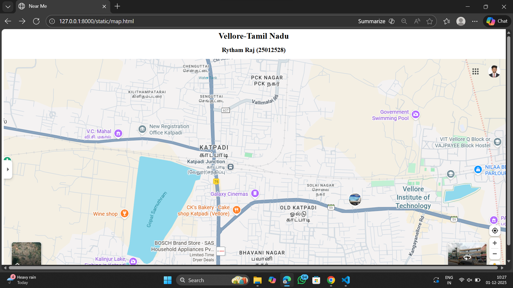
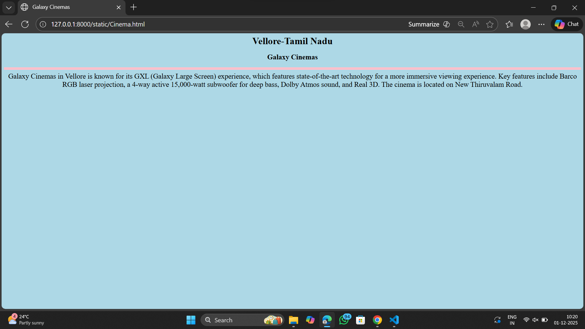
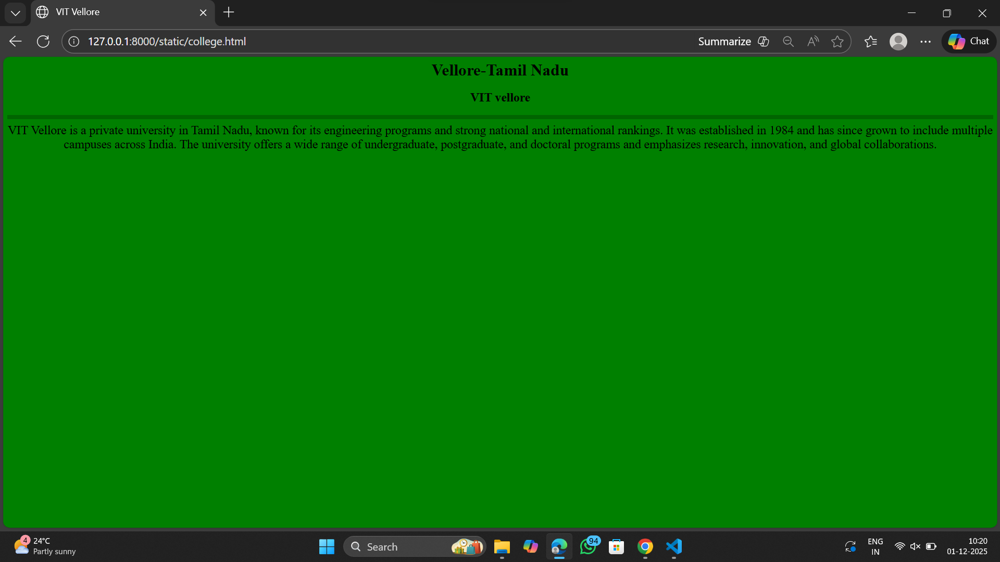
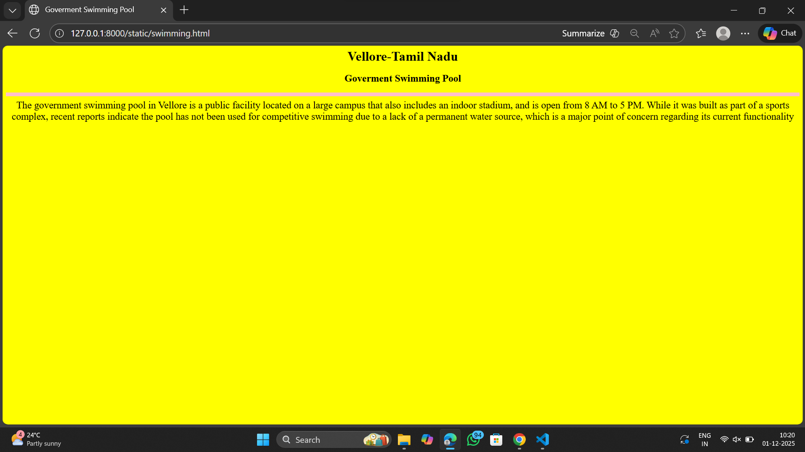
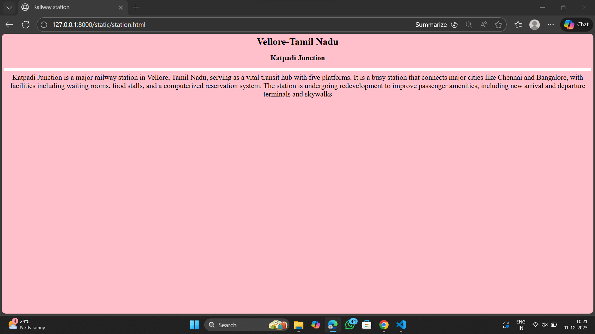
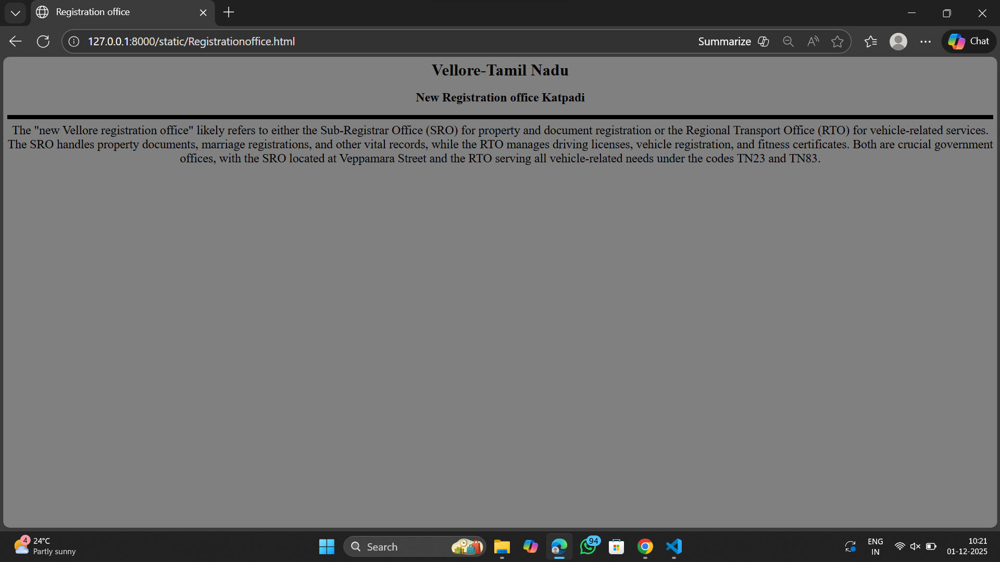

# Ex03 Places Around Me
## Date: 01/12/25

## AIM
To develop a website to display details about the places around my house.

## DESIGN STEPS

### STEP 1
Create a Django admin interface.

### STEP 2
Download your city map from Google as an image.

### STEP 3
Insert the image using `````` tag and link it to the map.

### STEP 4
Using ```<map>``` tag name the map.

### STEP 5
Create clickable regions in the image using ```<area>``` tag.

### STEP 6
Write HTML programs for all the regions identified.

### STEP 7
Execute the programs and publish them.

## CODE

```
map.html

<html>
    <head>
        <title>Near Me</title>
    </head>
    <body align="center">
        <h1 align ="center">Vellore-Tamil Nadu</h1>
        <h2 align ="center">Rytham Raj (25012528)</h2>
        
    

<map name="image-map">
    <area target="" alt="New Registration Office Katpadi" title="New Registration Office Katpadi" href="Registrationoffice.html" coords="498,237,714,296" shape="rect">
    <area target="" alt="Katpadi Junction" title="Katpadi Junction" href="station.html" coords="780,399,81" shape="circle">
    <area target="" alt="Galaxy Cinemas" title="Galaxy Cinemas" href="Cinema.html" coords="775,541,772,499,878,448,981,497,985,541" shape="poly">
    <area target="" alt="Vellore Institute of Technology" title="Vellore Institute of Technology" href="college.html" coords="1500,467,1615,463,1674,526,1637,590,1473,585,1439,521" shape="poly">
    <area target="" alt="Government Swimming Pool" title="Government Swimming Pool" href="swimming.html" coords="1387,182,1603,256" shape="rect">
     
    </body>
</html>

Cinema.html

<html>
    <head>
        <title>
            Galaxy Cinemas
        </title>
    </head>
    <body align="center" bgcolor="lightblue">
        <h1>Vellore-Tamil Nadu </h1>
        <h2>Galaxy Cinemas</h2>
        <hr size="9" color="pink">
        <font size="5">
            Galaxy Cinemas in Vellore is known for its GXL (Galaxy Large Screen) experience, which features state-of-the-art technology for a more immersive viewing experience. Key features include Barco RGB laser projection, a 4-way active 15,000-watt subwoofer for deep bass, Dolby Atmos sound, and Real 3D. The cinema is located on New Thiruvalam Road. 
        </font>
        
    </body>
</html>

college.html

<html>
    <head>
        <title>
           VIT Vellore
        </title>
    </head>
    <body align="center" bgcolor="green">
        <h1>Vellore-Tamil Nadu </h1>
        <h2>VIT vellore</h2>
        <hr size="9" color="darkgreen">
        <font size="5">
          VIT Vellore is a private university in Tamil Nadu, known for its engineering programs and strong national and international rankings. It was established in 1984 and has since grown to include multiple campuses across India. The university offers a wide range of undergraduate, postgraduate, and doctoral programs and emphasizes research, innovation, and global collaborations.  
    </body>
</html>

swimming.html

<html>
    <head>
        <title>
            Goverment Swimming Pool
        </title>
    </head>
    <body align="center" bgcolor="yellow">
        <h1>Vellore-Tamil Nadu </h1>
        <h2>Goverment Swimming Pool</h2>
        <hr size="10" color="pink">
        <font size="5">
            The government swimming pool in Vellore is a public facility located on a large campus that also includes an indoor stadium, and is open from 8 AM to 5 PM. While it was built as part of a sports complex, recent reports indicate the pool has not been used for competitive swimming due to a lack of a permanent water source, which is a major point of concern regarding its current functionality
        </font>
        
    </body>
</html>

station.html

<html>
    <head>
        <title>
           Railway station
        </title>
    </head>
    <body align="center" bgcolor="pink">
        <h1>Vellore-Tamil Nadu </h1>
        <h2>Katpadi Junction</h2>
        <hr size="9" color="white">
        <font size="5">
           Katpadi Junction is a major railway station in Vellore, Tamil Nadu, serving as a vital transit hub with five platforms. It is a busy station that connects major cities like Chennai and Bangalore, with facilities including waiting rooms, food stalls, and a computerized reservation system. The station is undergoing redevelopment to improve passenger amenities, including new arrival and departure terminals and skywalks
    </body>
</html>

Registrationoffice.html

<html>
    <head>
        <title>
           Registration office
        </title>
    </head>
    <body align="center" bgcolor="grey">
        <h1>Vellore-Tamil Nadu </h1>
        <h2>New Registration office Katpadi</h2>
        <hr size="9" color="black">
        <font size="5">
          The "new Vellore registration office" likely refers to either the Sub-Registrar Office (SRO) for property and document registration or the Regional Transport Office (RTO) for vehicle-related services. The SRO handles property documents, marriage registrations, and other vital records, while the RTO manages driving licenses, vehicle registration, and fitness certificates. Both are crucial government offices, with the SRO located at Veppamara Street and the RTO serving all vehicle-related needs under the codes TN23 and TN83.
    </body>
</html>

```

## OUTPUT








## RESULT
The program for implementing image maps using HTML is executed successfully.
